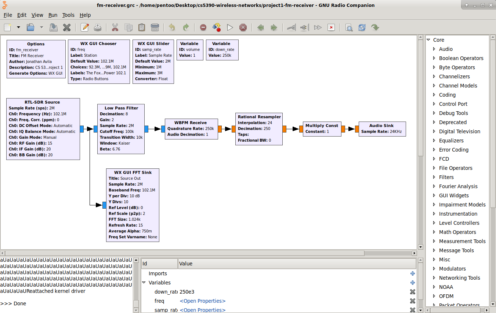
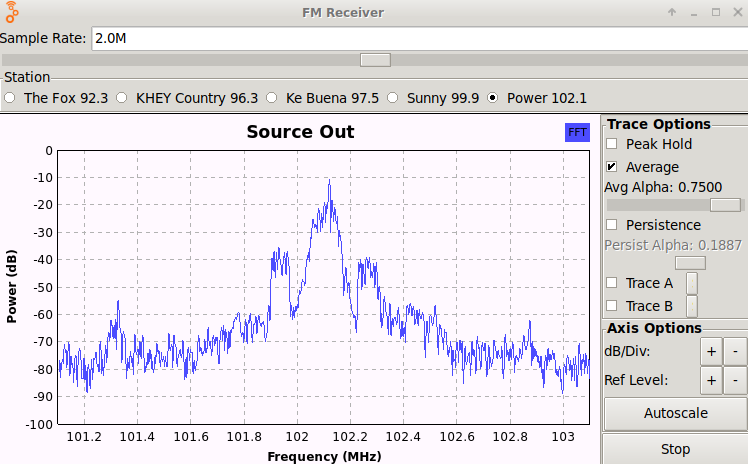
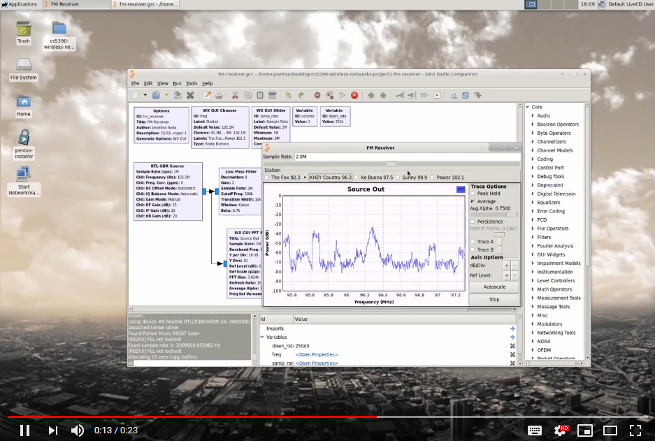

# Project 1 - FM Receiver

Use an RLT-SDR as an FM Receiver with [GNURadio](https://www.gnuradio.org/), a toolkit that provides signal processing blocks to implement software radios. This project has been tested with Pentoo 2015.0 RC5.

## Tutorial

1. Launch GNU Radio Companion.

1. Open `fm-receiver.grc` to view the flow graph.

1. Click 'Execute the flow graph' to launch the GUI.

1. Select a radio station to tune in. Radio stations listed are for the El Paso, Texas area.

## Demo

Video demo on YouTube.

## Troubleshooting

If playback is choppy, try editing `/etc/gnuradio/conf.d/gr-audio-asla.conf` to use `nperiods = 32`.
