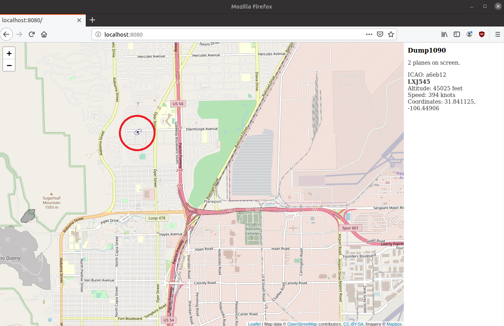

# Project 2 - Aircraft Radar

Use an RLT-SDR as an ADS-B aircraft radar with [Dump1090](https://github.com/antirez/dump1090), a Mode S decoder for RTL-SDR devices. This project has been tested with Ubuntu 19.10.

## Tutorial

1. [Install Dump1090](https://github.com/antirez/dump1090#installation).
1. Run Dump1090 in interactive mode with networking support.

    ```bash
    sudo ./dump1090 --interactive --net
    ```

1. Capture some traffic.


1. Connect your browser to <http://localhost:8080>. You may need to disable any add-ons that block web content, such as NoScript, for the map to display properly.

1. Click on a flight for more information.


1. Verify this information with a reputable flight tracking website such as FlightAware.

